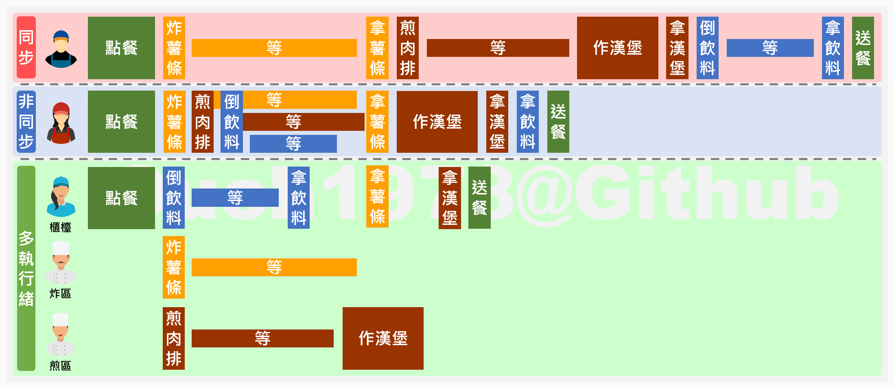

# JUC-多線程

## 甚麼是多線程

多線程是指一個程序中包含了多個執行緒，這樣一來，每個執行緒都可以同時進行不同的任務執行緒，也就是說，多線程可以同時執行多個任務。
多線程與非同步在[這篇](https://ouch1978.github.io/blog/2022/09/25/understand-sync-async-and-multi-thread-with-one-pic)文章內有大概的說明，重點是非同步並不會增加執行緒。


## 為什麼要使用多執行緒?

### 硬體

現在的電腦都是多核心的，如果只使用單執行緒，那麼其他的核心就會閒置，這樣就會造成資源的浪費。

### 軟體

如果一個程式只有單執行緒，那麼當程式遇到阻塞時，整個程式都會被阻塞，這樣就會造成資源的浪費。


### thread start 底層概述

- 編寫一段簡單的程式碼，並且執行，觀察結果
```java
public static void main(String[] args) {

        Thread t1 = new Thread(() ->{
            System.out.println("Hello from thread 1");
        });

        t1.start();

//        start會調用start0，並將started設為true，代表已經啟動
//        start0是個native method，表示是用C寫的底層方法，也就是說這個方法是在非Java代碼中實現的，通常是在C或C++中。這樣的方法被稱為本地方法。
//        本地方法允許Java與作業系統或硬體進行交互，或者訪問系統級別的資源。在Thread類別中，start0方法是用來啟動一個新的執行緒的，這個操作涉及到底層的系統調用，因此需要在本地代碼中實現。

    }
```
- jdk中有關thread的底層程式碼位置(以 openjdk8 為例)
  - `openjdk8/src/share/native/java/lang/Thread.c`
  - `openjdk8/src/share/vm/prims/jvm.cpp`
  - `openjdk8/src/share/vm/runtime/thread.cpp`
- java的線程是通過`start`的方法啟動執行，主要內容在native方法`start0`中
- openjdk寫的JNI(Java Native Interface)通常是1:1的，也就是說Thread.java對應的就是Thread.c
- 所以在查看JNINativeMethod的時候，可以在Thread.c中找到對應的方法，就是`start0`
    
    
    

## 多線程相關概念

- 一把鎖
- 兩個併
  - 併發( Concurrent ):如同一時間，一堆人搶同一個票
    - 是在同一個實體上的多個事件(這裡實體是指CPU)
    - 是在一台處理器上，同一個時間間隔內，同時處理多個任務
    - 同一時刻，其實只有一個事件在發生
  - 併行( Parallel ):如同一時間有人去煮飯，有人去洗衣服
    - 是在不同實體上的多個事件
    - 是在多台處理器上，同一個時間間隔內，同時處理多個任務
    - 同一時刻，有多個事件在發生，你做你的，我做我的
- 三個程
  - 進程:一個程序的執行實例，如系統管理員看到我正在使用的程式就是進程，ex:廠房
  - 線程:一個進程中的執行單元，如一個進程中的多個執行緒，ex:廠房中的工人
  - 管程:一種同步工具，用於控制多個執行緒對共享資源的訪問
    - Monitor，也就是我們平常說的鎖，是一種同步工具，用於控制多個執行緒對共享資源的訪問
- 用戶線程與守護線程
  - 用戶線程( User Thread ):默認都是用戶線程，主要用於處理業務邏輯，當所有的用戶線程都結束時，JVM就會結束，如main方法
  - 守護線程( Daemon Thread ):主要用於處理用戶線程的輔助工作，當所有的用戶線程都結束時，JVM就會結束，如GC線程(垃圾回收線程)
  - 簡單範例，利用`setDaemon`方法設置為守護線程，觀察結果
  ```java
  // 判斷微 user thread or daemon thread
    public static void judgeDaemonThreadOrUserThread() {
        Thread t1 = new Thread(() -> {
            System.out.println("Hello from thread 1");
            while (true) {

            }
        });
    //        open this line, t1 will be daemon thread
    //        when main thread is done, t1 will be terminated

    //        comment this line, t1 will be user thread
    //        main thread is done, but t1 is still running, so the program is not terminated.
    //        t1.setDaemon(true);
            t1.start();
            
            System.out.println("main thread is done");
            
        }
  ```

## Future API

- Future API是一個介面，用於表示一個異步計算的結果，提供了方法來檢查計算是否完成，等待計算完成，檢索計算結果。可以為主線程開一個子線程，讓子線程去執行任務，主線程可以繼續執行其他任務，當需要子線程的結果時，再通過Future獲取結果。
- 簡單範例，利用`Future`來實現
    ```java
        public static void futureAPI() {
    //         ExecutorService 是一個介面，定義了一些方法，可以用來管理和執行執行緒
    //         Executors 是一個工具類，提供了一些靜態方法，用來創建不同類型的執行緒池
    //         newFixedThreadPool 創建一個固定大小的執行緒池，並且每次提交一個任務就創建一個執行緒，直到達到最大的執行緒數，這時候會將提交的任務存入到等待隊列中
            ExecutorService executorService = Executors.newFixedThreadPool(1);
    //        submit方法用來提交任務，並且返回一個Future，代表了將來要返回的結果
            Future<String> future = executorService.submit(() -> {
                Thread.sleep(5000);
                return "Hello from Callable, It will be returned after 5 seconds";
            });

            System.out.println("do something else");

    //        透過future.get()方法可以獲取結果，如果任務還沒有執行完，則會阻塞等待
            try {
                String result = future.get();
                System.out.println(result);
            } catch (InterruptedException | ExecutionException e) {
                e.printStackTrace();
            }

            executorService.shutdown();
        }
    ```

## Runable, Callable, Future, FutureTask example

- Runable是一個介面，只有一個run方法，用於定義一個任務，可以通過Thread或者ExecutorService來執行
- Callable是一個介面，只有一個call方法，用於定義一個任務，可以通過ExecutorService來執行，並且可以獲取結果
- Future是一個介面，定義了一些方法，用於獲取異步計算的結果
- FutureTask是一個類，實現了Future和Runnable，可以通過Thread或者ExecutorService來執行
  
- 簡單範例
    ```java
    public static void runableCallableFutureFutureTask() throws ExecutionException, InterruptedException {
        // Runnable example
        // Runnable是一個接口，它代表一個要由線程執行的任務
        Runnable runnableTask = () -> {
            System.out.println("Runnable task is running");
        };
        new Thread(runnableTask).start(); // 創建一個新的線程來執行Runnable任務

        // Callable and Future example
        // Callable是一個接口，它代表一個會返回結果的任務
        Callable<String> callableTask = () -> {
            Thread.sleep(1000);
            return "Callable task's result";
        };
        ExecutorService executorService = Executors.newSingleThreadExecutor(); // 創建一個單線程的ExecutorService
        Future<String> future = executorService.submit(callableTask); // 提交Callable任務並獲得一個Future
        System.out.println("Future result: " + future.get()); // 使用Future的get方法來獲取任務的結果

        // FutureTask example
        // FutureTask是一種可以取消的異步計算，它實現了Runnable和Future接口
        FutureTask<String> futureTask = new FutureTask<>(callableTask); // 創建一個FutureTask
        new Thread(futureTask).start(); // 創建一個新的線程來執行FutureTask
        System.out.println("FutureTask result: " + futureTask.get()); // 使用FutureTask的get方法來獲取任務的結果

        executorService.shutdown(); // 關閉ExecutorService
    }   
    ```

## 比較有沒有使用多線程的差別

### 沒有使用多線程
```java
    public static void oneThread() {

//        三個任務，目前只有一個線程 main 來處理，耗時多久?

//        1. start
        long start = System.currentTimeMillis();

//        2. tasks
        for (int i = 0; i < 3; i++) {
            try {
                Thread.sleep(1000);
                System.out.println("Hello from thread " + i);
            } catch (InterruptedException e) {
                e.printStackTrace();
            }
        }

//        3. end
        long end = System.currentTimeMillis();

//        4. print result
        System.out.println("One thread 耗時: " + (end - start) + " ms");
    }
```
```console
Hello from thread 0
Hello from thread 1
Hello from thread 2
One thread 耗時: 3027 ms
```

### 使用多線程1

- 直接創建了三個新的線程來執行任務。這種方法更為直接，但是缺乏對線程生命週期的控制，並且不能獲取任務的結果。
```java
    public static void threeThreads() {

//        三個任務，用三個線程來處理，耗時多久?

//        1. start
        long start = System.currentTimeMillis();

//        2. tasks
        for (int i = 0; i < 3; i++) {
            new Thread(() -> {
                try {
                    Thread.sleep(1000);
                    System.out.println("Hello from thread " + Thread.currentThread().getName());
                } catch (InterruptedException e) {
                    e.printStackTrace();
                }
            }).start();
        }

//        3. end
        long end = 0;
        while (Thread.activeCount() > 2) {
            end = System.currentTimeMillis();
        }

//        4. print result
        System.out.println("Three threads 耗時: " + (end - start) + " ms");
    }
```
```console
Hello from thread Thread-2
Hello from thread Thread-0
Hello from thread Thread-1
Three threads 耗時: 1007 ms
```

### 使用多線程2

- 使用了FutureTask和ExecutorService。FutureTask是一種可以取消的異步計算任務，它實現了Runnable和Future接口。ExecutorService是一種服務，它可以管理和控制線程的生命週期，包括創建、啟動、關閉線程等。在這段程式碼中，每個任務都被包裝成一個FutureTask，然後被提交到ExecutorService來執行。
```java
    public static void useFutureTaskForThreeThreads() {

//        三個任務，用三個線程來處理，耗時多久?

//        1. start
        long start = System.currentTimeMillis();

//        2. tasks
        ExecutorService executorService = Executors.newFixedThreadPool(3);
        FutureTask<String> futureTask1 = new FutureTask<>(() -> {
            try {
                Thread.sleep(1000);
                System.out.println("Hello from thread " + Thread.currentThread().getName());
            } catch (InterruptedException e) {
                e.printStackTrace();
            }
            return "Hello from thread " + Thread.currentThread().getName() + " is done";
        });
        executorService.submit(futureTask1);

        FutureTask<String> futureTask2 = new FutureTask<>(() -> {
            try {
                Thread.sleep(1000);
                System.out.println("Hello from thread " + Thread.currentThread().getName());
            } catch (InterruptedException e) {
                e.printStackTrace();
            }
            return "Hello from thread " + Thread.currentThread().getName() + " is done";
        });
        executorService.submit(futureTask2);

        FutureTask<String> futureTask3 = new FutureTask<>(() -> {
            try {
                Thread.sleep(1000);
                System.out.println("Hello from thread " + Thread.currentThread().getName());
            } catch (InterruptedException e) {
                e.printStackTrace();
            }
            return "Hello from thread " + Thread.currentThread().getName() + " is done";
        });
        executorService.submit(futureTask3);

        executorService.shutdown(); //ExecutorService的shutdown方法並不會立即終止執行中的任務，而是會禁止新的任務被提交到執行器服務。所有已經提交的任務都會被執行完畢。

//        3. end
        long end = 0;
        while (!futureTask1.isDone() || !futureTask2.isDone() || !futureTask3.isDone()) {
            end = System.currentTimeMillis();
        }
//        4. print result
        System.out.println("Three use FutureTask 耗時: " + (end - start) + " ms");

    }
```
```console
Hello from thread pool-1-thread-1
Hello from thread pool-1-thread-2
Hello from thread pool-1-thread-3
Three use FutureTask 耗時: 1022 ms
```

## Timeout

- 指定5秒，但我設訂的時間是3秒，所以會拋出TimeoutException
```java
    public static void main(String[] args) throws ExecutionException, InterruptedException, TimeoutException {

        timeoutTest(5);

    }

    public static void timeoutTest(int timeout) throws ExecutionException, InterruptedException, TimeoutException {

        FutureTask<String> futureTask = new FutureTask<>(() -> {
            System.out.println("Hello from thread " + Thread.currentThread().getName());
            // 將此線程暫停5秒
            try {
                Thread.sleep(5000);
            } catch (InterruptedException e) {
                e.printStackTrace();
            }
            return "Task done";
        });
        // the second parameter is the return value of Thread.currentThread().getName()
        Thread t1 = new Thread(futureTask, "t1");
        t1.start();

        System.out.println("main thread is done");

        System.out.println(futureTask.get(3, TimeUnit.SECONDS));

    }
```
```console
main thread is done
Hello from thread t1
Exception in thread "main" java.util.concurrent.TimeoutException
	at java.base/java.util.concurrent.FutureTask.get(FutureTask.java:204)
	at org.example.FutureTaskTimeout.timeoutTest(FutureTaskTimeout.java:33)
	at org.example.FutureTaskTimeout.main(FutureTaskTimeout.java:12)

```

## CompletableFuture

### 為什麼又多了一個CompletableFuture

- 在使用Future的時候遇到了幾個問題
  - Future的get方法是阻塞的，如果不調用get方法，則無法獲取結果
  - Future的get方法只能獲取結果，無法處理任務完成後的其他事情
  - Future的isDone方法只能使用輪巡的方式來判斷任務是否完成，這樣會浪費CPU資源

### CompletableFuture的接口

- CompletableFuture 是一個實現了 Future 和 CompletionStage  接口的類，它提供了非常豐富的方法來處理異步計算的結果。
- CompletionStage 中常用的方法
  - runAsync : 執行一個 Runnable 任務，無返回值
  - supplyAsync : 執行一個 Callable 任務，並且返回一個新的 CompletionStage
  - thenApply : 當前任務完成後，將結果作為參數傳遞給下一個任務
  - thenAccept : 當前任務完成後，將結果作為參數傳遞給下一個任務，但是不返回結果
  - thenRun : 當前任務完成後，執行下一個任務，但是不接受上一個任務的結果
  - thenCompose : 當前任務完成後，將結果作為參數傳遞給下一個任務，並且返回一個新的 CompletionStage
  - thenCombine : 當前任務完成後，將結果作為參數傳遞給下一個任務，並且返回一個新的 CompletionStage ，新的 CompletionStage 的結果是上一個任務的結果和下一個任務的結果的組合
- runAsync 範例
  ```java
    public static void useRunAsync() {

            System.out.println("1. useRunAsync");

    //         runAsync use Runnable, so there is no return value
    //         if you don't use specify the thread pool, it will use ForkJoinPool.commonPool()
    //         commpletebleFuture: 是一個非同步的工具，可以讓你在一個thread裡面做完一件事情之後，再去做另一件事情
    //          所以在這行 CompletableFuture.runAsync 時，就會開一個新的thread，去做裡面的事情，而 main thread 就會繼續往下做
    //        所以會先印出 "main thread is done brfore join line"，再印出 "Hello from RunAsync thread who use ForkJoinPool.commonPool-worker-1"
            CompletableFuture<Void> future = CompletableFuture.runAsync(() -> {
                try {
                    TimeUnit.SECONDS.sleep(1);
                    System.out.println("3. Hello from RunAsync thread who use" + Thread.currentThread().getName());
                } catch (InterruptedException e) {
                    throw new RuntimeException(e);
                }
            }).whenComplete((aVoid, throwable) -> {
                System.out.println("4. runAsync in whenComplete");
            });

            System.out.println("2. main thread is done brfore join line");
            // join() 是一個blocking method，會等到future裡面的事情做完之後，才會繼續往下做，所以會等到上面的future做完之後，才會印出下面的字
            future.join();

            System.out.println("5. after join line");

            // 沒有指定線程池的話，會用 ForkJoinPool.commonPool()，且在 main thread 執行完之後，就會自動關閉

        }
  ```
  ```console
    1. useRunAsync
    2. main thread is done brfore join line
    3. Hello from RunAsync thread who useForkJoinPool.commonPool-worker-1
    4. runAsync in whenComplete
    5. after join line
  ```
  
- supplyAsync 範例
    ```java
    public static void useSupplyAsync() {

        System.out.println("1. useSupplyAsync");

        ExecutorService es = Executors.newFixedThreadPool(3);

        // supplyAsync use Supplier, so there is a return value
        // if you use specify the thread pool, it will a new thread pool
        CompletableFuture<String> future = CompletableFuture.supplyAsync(() -> {
            try {
                TimeUnit.SECONDS.sleep(1);
                System.out.println("3. Hello from thread who use" + Thread.currentThread().getName());
                return "5. SupplyAsync task done";
            } catch (InterruptedException e) {
                throw new RuntimeException(e);
            }
        }, es).whenComplete((s, throwable) -> {
            System.out.println("4. supplyAsync in whenComplete");
        }).exceptionally(throwable -> {
            System.out.println("exception happened");
            return null;
        });

        System.out.println("2. main thread is done before join line");

        System.out.println(future.join());

        System.out.println("6. after join line");

    //        有指定線程池的話，會用指定的線程池，且在 main thread 執行完之後，不會自動關閉，所以要自己關閉
        es.shutdown();
        
    }
    ```
    ```console
    1. useSupplyAsync
    2. main thread is done before join line
    3. Hello from thread who usepool-1-thread-1
    4. supplyAsync in whenComplete
    5. SupplyAsync task done
    6. after join line
    ```
## 多線程查詢的實際案例
```java

/*
1. 需求
    1.1 同一款產品，同時搜索出同款商品在各大店商平台的售價
    2.2 同一款產品，同時搜索出本產品在同一個店商平台下，各個入駐賣家的售價

2. 輸出: 出來的結果希望是同款產品在不同地方的嫁個顛列表，返回一個List<String>
    <<mySQL>> in jd price: 100
    <<mySQL>> in dangdang price: 200
    <<mySQL>> in taobao price: 300
 3. 技術需求
    3.1 functional programming
    3.2 chain pattern
    3.3 Stream流式計算
 */

@Data
@Builder
@Accessors(chain = true)
@AllArgsConstructor
@NoArgsConstructor
class NetMall {

    private String netMallName;

    public double calculatePrice(String productName) {
        try {
            TimeUnit.SECONDS.sleep(1);
        } catch (InterruptedException e) {
            e.printStackTrace();
        }
        return ThreadLocalRandom.current().nextDouble() * 2 + productName.charAt(0);

    }

}

public class CompleteableFutureMallDemo {

    public static void main(String[] args) {

//        Demo 1: 一家家搜, 沒有使用多執行緒
        long startTime = System.currentTimeMillis();
        System.out.println(getPrice("mysql"));
        long endTime = System.currentTimeMillis();
        System.out.println("Did't use CompletableFuture: " + (endTime - startTime) + "ms");

//        Demo 2: 使用 completableFuture
//        note: 使用了 CompletableFuture，它是 Java 8 引入的一種更靈活的並行處理方式。
//              特點如下：
//              可以更靈活地控制並發處理，例如，您可以自訂線程池，設置超時，或者應對多個異步操作。
//              適合處理較複雜的並行任務，其中每個元素的處理可能需要不同的線程。
//              可以使用 join 方法等待所有 CompletableFuture 完成，以確保獲得最終結果。
//              缺點：
//              使用相對較多的程式碼，需要額外的 CompletableFuture 相關操作，可能不如 parallelStream 簡單。
//              需要更多的理解和掌握，特別是在處理較複雜的並行情況時。
        long startTime2 = System.currentTimeMillis();
        System.out.println(getPriceByCompletableFuture("mysql"));
        long endTime2 = System.currentTimeMillis();
        System.out.println("Use CompletableFuture: " + (endTime2 - startTime2) + "ms");

//        Demo 3: 使用 parallelStream
//        note: 使用了 Java 8 引入的 parallelStream() 方法，它將串行的流轉換為並行流，並利用多核處理器進行並行處理。
//              特點如下：
//              使用簡單，只需一行程式碼即可實現並行處理。
//              較適合用於對一個集合中的元素進行相對簡單的操作，如映射和過濾。
//              與串行流相比，相對容易理解和維護。
//              缺點：
//              不太適合處理複雜的並行任務，無法自訂線程數或控制並行處理的細節。
//              在某些情況下，可能會產生性能問題，因為它可能會過度並行，導致多線程競爭和上下文切換。
        long startTime3 = System.currentTimeMillis();
        System.out.println(getPriceByParallelStream("mysql"));
        long endTime3 = System.currentTimeMillis();
        System.out.println("Use parallelStream: " + (endTime3 - startTime3) + "ms");


//        如果您只需要簡單的並行處理，而且不需要太多細節控制，則 parallelStream 是一個簡單且有效的方法。
//        如果您需要更多控制，或者處理複雜的並行任務，那麼 CompletableFuture 提供了更大的靈活性。

    }

    static List<NetMall> list = Arrays.asList(
            NetMall.builder().netMallName("jd").build(),
            NetMall.builder().netMallName("dangdang").build(),
            NetMall.builder().netMallName("taobao").build(),
            NetMall.builder().netMallName("tmall").build(),
            NetMall.builder().netMallName("amazon").build(),
            NetMall.builder().netMallName("ebay").build(),
            NetMall.builder().netMallName("aliexpress").build(),
            NetMall.builder().netMallName("walmart").build(),
            NetMall.builder().netMallName("costco").build()
    );

    /**
     * step by step 一家家搜
     * @param productName
     * @return List<String>
     */
    public static List<String> getPrice(String productName) {
        return list.stream()
                .map(netMall -> productName + " in " + netMall.getNetMallName() + " price: " + String.format("%.2f", netMall.calculatePrice(productName)))
                .toList();
    }

    /**
     * 使用CompletableFuture，同時搜
     * @param productName
     * @return List<String>
     */
    public static List<String> getPriceByCompletableFuture(String productName) {
        return list.stream()
                .map(netMall -> CompletableFuture.supplyAsync(() -> netMall.getNetMallName() + " price: " + String.format("%.2f", netMall.calculatePrice(productName))))
                .toList()
                .stream()
                .map(CompletableFuture::join)
                .toList();
    }

    /**
     * 使用 parallelStream，同時搜
     * @param productName
     * @return List<String>
     */
    public static List<String> getPriceByParallelStream(String productName) {
        return list.parallelStream()
                .map(netMall -> netMall.getNetMallName() + " price: " + String.format("%.2f", netMall.calculatePrice(productName)))
                .toList();
    }

}
```
```console
[mysql in jd price: 109.18, mysql in dangdang price: 109.40, mysql in taobao price: 109.29, mysql in tmall price: 109.75, mysql in amazon price: 110.44, mysql in ebay price: 110.44, mysql in aliexpress price: 109.97, mysql in walmart price: 110.07, mysql in costco price: 109.24]
Did't use CompletableFuture: 9148ms
[jd price: 110.83, dangdang price: 110.04, taobao price: 109.32, tmall price: 109.22, amazon price: 110.53, ebay price: 110.80, aliexpress price: 109.22, walmart price: 109.60, costco price: 110.04]
Use CompletableFuture: 1032ms
[jd price: 109.20, dangdang price: 110.58, taobao price: 110.67, tmall price: 109.70, amazon price: 109.21, ebay price: 110.69, aliexpress price: 109.85, walmart price: 110.09, costco price: 110.09]
Use parallelStream: 1019ms
```

## CompletableFuture 中常用的方法
```java
public class CompletableFuturePopularMethod {

    public static void main(String[] args) throws ExecutionException, InterruptedException, TimeoutException {

       get();
       getWithTimeout();
       join();
       getNow(2); // parameter is how many seconds you want to wait, 1 second will get the default value, 2 seconds will get the result
       complete(1); // parameter is how many seconds you want to wait, 1 second will get the default value, 2 seconds will get the result
       thenApply();
       handle();
       thenAccept();
       mixThenRunThenAcceptThenApply();
       selectThreadPool();
       combineTwoCompletableFuture();
    }

    /**
     * `
     * get result from completableFuture
     * get() is a blocking method, it will throw ExecutionException if the task is failed
     * get() is a blocking method, we can set a timeout for it
     * join() is a blocking method, it will throw CompletionException if the task is failed,and we can use getCause() to get the real exception, it's eaiser to find the root cause,
     * getNow() is a non-blocking method, it will return the result if the task is done, or it will return the default value
     * complete() is a non-blocking method, it will return true if the task is done, or it will return false and the task will be canceled, and set the result to the default value
     */
    public static void get() throws ExecutionException, InterruptedException {
        CompletableFuture<String> completableFuture = CompletableFuture.supplyAsync(() -> {
            try {
                Thread.sleep(1000);
                return "Hello from completableFuture";
            } catch (InterruptedException e) {
                throw new RuntimeException(e);
            }
        });

//        note: get() is a blocking method, it will throw ExecutionException if the task is failed
        System.out.println(completableFuture.get());
    }

    public static void getWithTimeout() throws ExecutionException, InterruptedException, TimeoutException {
        CompletableFuture<String> completableFuture = CompletableFuture.supplyAsync(() -> {
            try {
                Thread.sleep(2000);
                return "Hello from completableFuture";
            } catch (InterruptedException e) {
                throw new RuntimeException(e);
            }
        });

//        note: get() is a blocking method, we can set a timeout for it
        System.out.println(completableFuture.get(1000, TimeUnit.MILLISECONDS));
    }

    public static void join() {
        CompletableFuture<String> completableFuture = CompletableFuture.supplyAsync(() -> {
            try {
                Thread.sleep(1000);
                return "Hello from completableFuture";
            } catch (InterruptedException e) {
                throw new RuntimeException(e);
            }
        });

//        note: join() is a blocking method, it will throw CompletionException if the task is failed,
//        and we can use getCause() to get the real exception, it's eaiser to find the root cause,
//        and it's won't force us to catch the exception
        System.out.println(completableFuture.join());
    }

    public static void getNow(Integer waitForSecond) throws InterruptedException {
        CompletableFuture<String> completableFuture = CompletableFuture.supplyAsync(() -> {
            try {
                Thread.sleep(1000);
                return "Hello from completableFuture";
            } catch (InterruptedException e) {
                throw new RuntimeException(e);
            }
        });

//        note: getNow() is a non-blocking method, it will return the result if the task is done,
//        or it will return the default value
        Thread.sleep(waitForSecond * 1000);
        System.out.println(completableFuture.getNow("getNow default value"));
    }

    public static void complete(Integer waitForSecond) throws InterruptedException {
        CompletableFuture<String> completableFuture = CompletableFuture.supplyAsync(() -> {
            try {
                Thread.sleep(1000);
                return "Hello from completableFuture";
            } catch (InterruptedException e) {
                throw new RuntimeException(e);
            }
        });

//        note: complete() is a non-blocking method, it will return true if the task is done,
//        or it will return false and the task will be canceled, and set the result to the default value
        Thread.sleep(waitForSecond * 1000);
        System.out.println(completableFuture.complete("complete default value") + " " + completableFuture.join());
    }


    /**
     * trigger a task when completableFuture is done
     * thenApply(): 這個方法在異步操作完成後，對結果進行轉換或計算，並返回一個新的 CompletableFuture。如果原始 CompletableFuture 完成時發生異常，則不會調用 thenApply 函數。
     * handle(): 這個方法在異步操作完成後，無論成功還是異常，都會被調用。它可以用來處理異常，或者在計算結果時考慮到可能的異常。
     */

    public static void thenApply() {

        CompletableFuture completableFuture = CompletableFuture.supplyAsync(() -> {
                    try {
                        Thread.sleep(1000);
                        return "Hello from completableFuture";
                    } catch (InterruptedException e) {
                        throw new RuntimeException(e);
                    }
                }).thenApply(s -> {
                    System.out.println("in thenApply 1");
                    return s + " thenApply 1 ";
                }).thenApply(s -> {
                    int i = 1 / 0; // comment or uncomment this line to see the difference between thenApply() and handle()
                    System.out.println("in thenApply 2");
                    return s + " thenApply 2";
                }).thenApply(s -> {
                    System.out.println("in thenApply 3");
                    return s + " thenApply 3";
                })
                .whenComplete((result, exception) -> {
                    if (exception == null) {
                        System.out.println("--------計算結果: " + result);
                    }
                }).exceptionally(exception -> {
                    System.out.println("--------exception: " + exception.getMessage());
                    return null;
                });

//        在Java中，執行緒可以分為守護執行緒（daemon threads）和非守護執行緒（non-daemon threads）
//        守護執行緒（Daemon Threads）：
//          守護執行緒是應用程序中的背景執行緒，它們的存在不會防止應用程序的結束。
//          當所有的非守護執行緒結束時，守護執行緒會自動終止，而不會等待它們完成。
//          守護執行緒通常用於執行應用程序的一些低優先級工作，例如垃圾回收等。
//          你可以將執行緒設置為守護執行緒，使用 setDaemon(true) 方法。
//
//        非守護(使用者)執行緒（Non-Daemon Threads or User Threads）：
//          非守護執行緒是應用程序的主要執行緒，它們的存在會防止應用程序的結束。
//          當所有的非守護執行緒結束時，應用程序才會結束。
//          通常，應用程序的主執行緒和其他主要邏輯執行緒都是非守護執行緒。

//        到底下這行"main thread is done" user thread 就已經做完，會導致 app結束，線程池也會被關閉，所以沒有等到上面的 completableFuture（Daemon Threads） 做完
//        有兩種解決方案
//        1. 自己開新的線程池，不要與預設的 forkJoinPool 混用
//        2. 在最後加上一個 join()，讓 main thread 等待 completableFuture（Daemon Threads） 做完
//        3. 在此讓 user threads 睡一下，讓 completableFuture（Daemon Threads） 有時間做完

        System.out.println("main thread is done");

        completableFuture.join();

    }

    public static void handle() {

        CompletableFuture completableFuture = CompletableFuture.supplyAsync(() -> {
                    try {
                        Thread.sleep(1000);
                        return "Hello from completableFuture";
                    } catch (InterruptedException e) {
                        throw new RuntimeException(e);
                    }
                }).handle((s,e) -> {
                    System.out.println("in handle 1");
                    return s + " handle 1 ";
                }).handle((s,e) -> {
                    int i = 1 / 0; // comment or uncomment this line to see the difference between thenApply() and handle()
                    System.out.println("in handle 2");
                    return s + " handle 2";
                }).handle((s,e)  -> {
                    System.out.println("in handle 3");
                    return s + " handle 3";
                })
                .whenComplete((result, exception) -> {
                    if (exception == null) {
                        System.out.println("--------計算結果: " + result);
                    }
                }).exceptionally(exception -> {
                    System.out.println("--------exception: " + exception.getMessage());
                    return null;
                });

        System.out.println("main thread is done");

        completableFuture.join();

    }

    /**
     * process and consume result from completableFuture
     * thenAccept(): 沒有返回值，只是對結果進行消耗，所以在console中Hello from completableFuture thenAccept 1  thenAccept 2 後，只會看到null thenAccept 3
     */
    public static void thenAccept() {

        CompletableFuture completableFuture = CompletableFuture.supplyAsync(() -> {
                    try {
                        Thread.sleep(1000);
                        return "Hello from completableFuture";
                    } catch (InterruptedException e) {
                        throw new RuntimeException(e);
                    }
                }).thenApply(s -> {
                    System.out.println("in thenAccept 1");
                    return s + " thenAccept 1 ";
                }).thenAccept(s -> {
                    System.out.println("in thenAccept 2");
                    System.out.println(s + " thenAccept 2");
                }).thenAccept(s -> {
                    System.out.println("in thenAccept 3");
                    System.out.println(s + " thenAccept 3");
                })
                .whenComplete((result, exception) -> {
                    if (exception == null) {
                        System.out.println("--------計算結果: " + result);
                    }
                }).exceptionally(exception -> {
                    System.out.println("--------exception: " + exception.getMessage());
                    return null;
                });

        System.out.println("main thread is done");

        completableFuture.join();

    }

    public static void mixThenRunThenAcceptThenApply() {

        // thenRun: 無返回值，只是在上一步操作完成後，做一些事情
        System.out.print(CompletableFuture.supplyAsync(() -> "Hello")
                .thenRun(() -> {})
                .join()
        ); // should print null

        // thenAccept: 沒有返回值，只是對結果進行消耗
        System.out.print(CompletableFuture.supplyAsync(() -> "Hello")
                .thenAccept(s -> {})
                .join()
        ); // should print null

        // thenApply: 有返回值，可以對結果進行轉換或計算
        System.out.print(CompletableFuture.supplyAsync(() -> "Hello")
                .thenApply(s -> s + " world")
                .join()
        ); // should print Hello world

    }

    /**
     * select thread pool
     */
    public static void selectThreadPool() {

//        compare use thenRun() and thenRunAsync();

        ExecutorService es = Executors.newFixedThreadPool(3);

        CompletableFuture<Void> completableFuture = CompletableFuture.supplyAsync(() -> "Hello")
                .thenRun(() -> System.out.println(Thread.currentThread().getName() + " thenRun"))
                .thenRunAsync(() -> System.out.println(Thread.currentThread().getName() + " thenRunAsync"))
                .thenRunAsync(() -> System.out.println(Thread.currentThread().getName() + " thenRunAsync"), es);

        completableFuture.join();

        es.shutdown();

        /*
        output: 可能會有兩種結果
        1.
        main thenRun 照理未指定線程池，所以用預設的 ForkJoinPool.commonPool(),但因為效能夠，底層會自動調用最優的線程，所以就直接使用main了
        ForkJoinPool.commonPool-worker-1 thenRunAsync
        pool-1-thread-1 thenRunAsync
        2.
        ForkJoinPool.commonPool-worker-1 thenRun 未指定線程池，所以用預設的 ForkJoinPool.commonPool()
        ForkJoinPool.commonPool-worker-1 thenRunAsync 未指定線程池，所以用預設的 ForkJoinPool.commonPool()
        pool-1-thread-1 thenRunAsync
         */

    }

    /**
     * combine two completableFuture
     */
    public static void combineTwoCompletableFuture() {

        CompletableFuture<String> completableFuture1 = CompletableFuture.supplyAsync(() -> "Hello");
        CompletableFuture<String> completableFuture2 = CompletableFuture.supplyAsync(() -> " world");

        CompletableFuture<String> completableFuture3 = completableFuture1.thenCombine(completableFuture2, (s1, s2) -> s1 + s2);

        System.out.println(completableFuture3.join());

    }
}

```

## 鎖

### 樂觀鎖與悲觀鎖

樂觀鎖和悲觀鎖是兩種常見的同步策略，主要用於處理多線程環境中的資源競爭問題。

- 樂觀鎖：
  - 特性：樂觀鎖假設在大部分時間內，資源不會產生競爭，所以不需要加鎖，只在更新資源時才會檢查是否有其他線程修改了這個資源。在Java中，樂觀鎖通常由版本號（version）或者時間戳來實現。最常採用的是CAS算法，Java中的Atomic類就是使用CAS實現的。
  - 使用時機：當資源的競爭不激烈，讀操作遠多於寫操作時，使用樂觀鎖可以減少鎖的開銷，提高系統的吞吐量。
  - 優點：在無競爭或競爭較少的情況下，樂觀鎖的性能優於悲觀鎖。
  - 缺點：如果競爭激烈，樂觀鎖需要不斷重試，效率會變低。
- 悲觀鎖：
  - 特性：悲觀鎖假設在任何時候都可能有其他線程來競爭資源，所以在每次讀寫操作時都會先加鎖，確保在操作期間不會有其他線程修改這個資源。在Java中，悲觀鎖可以由synchronized關鍵字或者Lock接口來實現。
  - 使用時機：當資源的競爭激烈，寫操作多於讀操作時，使用悲觀鎖可以確保資源的一致性和安全性。
  - 優點：在競爭激烈的情況下，悲觀鎖可以避免不必要的重試，保證資源的一致性。
  - 缺點：悲觀鎖在任何情況下都會加鎖，可能會導致線程阻塞，降低系統的吞吐量。

- CAS: Compare And Swap
  - CAS是一種樂觀鎖的實現方式，它的原理是先比較目前的值是否與期望的值相等，如果相等，則更新為新的值，否則不做任何處理。CAS是一個原子操作，可以保證資源的一致性和安全性。
  - CAS的缺點是在競爭激烈的情況下，會一直重試，這樣會消耗大量的CPU資源，降低系統的吞吐量。為了解決這個問題，Java中的Atomic類提供了一些方法，可以限制CAS的重試次數，或者在重試次數達到一定的次數後，進行阻塞，等待一段時間後再重試。

- 用鎖的原則
  - 鎖的粒度越小越好，這樣才能減少鎖的競爭，提高系統的吞吐量。
  - 能不用鎖就不用鎖;能鎖區塊就不要鎖整個方法;能鎖對象就不要鎖類別。

### 8種不同鎖的狀況

請嘗試修改下面的程式碼，使得8種不同狀況，並觀察結果是否符合表記中的預期。

```java
class Phone {

    // 嘗試修改此方法 為 有無static、有無synchronized
    public synchronized  void sendEmail() {
        try {
            TimeUnit.SECONDS.sleep(4);
        } catch (InterruptedException e) {
            e.printStackTrace();
        }
        System.out.println("-------sendEmail");
    }

    // 嘗試修改此方法 為 有無static、有無synchronized
    public synchronized  void sendSMS() {
        System.out.println("-------sendSMS");
    }

    public void hello() {
        System.out.println("-------hello");
    }

}

/**
 * 8種鎖的案例說明
 * 1. 標準訪問有a b兩個執行緒，請問先打印email還是sms
 * 2. 在sendEmail方法新增Thread.sleep(4000)，請問先打印email還是sms
 * 3. 新增一個普通方法hello，請問先打印email還是hello
 * 4. 有兩部手機，請問先打印email還是sms
 * 5. 兩個靜態同步方法，同一部手機，請問先打印email還是sms
 * 6. 兩個靜態同步方法，兩部手機，phone1 sendEmail、phone2 sendSMS，請問先打印email還是sms
 * 7. 一個靜態同步方法，一個普通同步方法，同一部手機，請問先打印email還是sms
 * 8. 一個靜態同步方法，一個普通同步方法，兩部手機，phone1 sendEmail、phone2 sendSMS，請問先打印email還是sms
 */

/**
 * 預期筆記
 * 1-2.
 *  一個對象裡面如果有多個synchronized方法，某一個時刻內，只要有一個執行緒去調用其中的一個synchronized方法了，
 *  其他的執行緒都只能等待，也就是說，某一個時刻內，只能有一個執行緒去調用這些synchronized方法。
 *  換句話說，synchronized鎖的是當前對象this，被鎖定後，其他的執行緒都不能進入到當前對象的其他synchronized方法。
 * 3-4.
 *  加個普通方法發現和同步鎖無關，因為並沒有去爭搶資源
 *  換成兩個對象，synchronized鎖的this是不同的對象，所以不會有爭搶資源的問題
 * 5-6. 都換成靜態同步方法
 *  由於在class中的方法加上了靜態static，那摩說明該方法的synchronized是鎖在class上的，而不是被new出來的對象上
 *  也就是說，不管你new幾個物件，只要是同一個class，那麼他們就是同一把鎖
 * 7-8.
 *  當一個執行緒試圖訪問同步方法時，他首先必須獲得鎖，退出或者抛出異常時必須釋放鎖
 *  所有的普通同步方法都是用的同一把鎖——實例對象本身，就是new出來的對象，就是this
 *  也就是說如果一個實例對物件的痛不方法獲取鎖後，該實例對象的其他同步方法必須等待獲取鎖的方法釋放鎖後才能獲取鎖
 *
 *  所有的近太同步方法用的也是同一把鎖——類對象本身，就是我們這裡說的Phone.class
 *  具體實例對象this和類對象class是兩個不同的對象，所以他們用的是兩把不同的鎖，一個是this，一個是class
 *  但是一但一個近太同步方法獲取鎖後，其他的近太同步方法都必須等待該方法釋放鎖後才能獲取鎖
 *
 */
public class Lock8Demo {

    public static void main(String[] args) {

        Phone phone1 = new Phone();
        Phone phone2 = new Phone();

        // 常是修改以下方法，以phone1、phone2呼叫有不同修飾詞的方法(如1-8的案例)，觀察結果，是否符合預期筆記
        new Thread(() -> {
            phone1.sendEmail();
        }, "A").start();

        try {
            TimeUnit.SECONDS.sleep(1);
        } catch (InterruptedException e) {
            e.printStackTrace();
        }

        new Thread(() -> {
            phone1.sendSMS();
        }, "B").start();

        new Thread(() -> {
            phone1.hello();
        }, "C").start();

        new Thread(() -> {
            phone2.sendSMS();
        }, "D").start();

    }

}
```

### synchronized 

synchronized 可以用在以下幾種地方
- 修飾實例方法(物件被new出來的時候，就會產生一個實例)
- 修飾靜態方法(指被加上static的方法)
- 修飾程式碼區塊

#### 觀察 synchronized 如何實現

- 我們先新增一個類別如下，並把他編譯成class檔案
    ```java
    public class LockSyncDemo {

    //    用類別new出一個物件(實例)
        Object objectLockA = new Object();

        public void methodA() {
            synchronized (objectLockA) {
                System.out.println("methodA");
            }
        }

        public static void main(String[] args) {

            
        }

    }
    ``````
- 接著到專案的target資料夾中，找到LockSyncDemo.class，使用以下指令觀察class檔案的內容，我們可以發現在methodA()中，被synchronized修飾的區塊，被編譯成了monitorenter和monitorexit，這就表示synchronized是透過monitorenter來進行加鎖，透過monitorexit來進行解鎖。
- 在下圖中可以看到有一個monitorenter，但是有兩個monitorexit，第一個monitorenter配對到第一個monitorexit，第二個則是為了確認無論發生甚麼事情(甚至是exception)，都要把鎖釋放，所以在後面還可以看到一個athrow。
  ```console
  javap -c .\LockSyncDemo.class
  ```
    
    

- 我們把上述的code再延伸一下，看看實體鎖、物件鎖、方法鎖
  ```java
  public class LockSyncDemo {

    //    用類別new出一個物件(實例)
        Object objectLockA = new Object();

    //    將synchronized放在 objectLockA 上，代表當要執行synchronized (objectLockA) {}裡面的程式時，
    //    必須先獲取objectLockA的鎖，同一個時間只能有一個執行緒獲取到objectLockA的鎖，其他執行緒必須等待
        public void methodA() {
            synchronized (objectLockA) {
                System.out.println("methodA: synchronize on objectLockA");
            }
        }

    //    將synchronized放在方法上，也等同於將synchronized放在this上，
    //    也就是說，當你new出一個LockSyncDemo的物件時，只能有一個執行緒可以使用這個物件中帶有synchronized的方法，
    //    而其他沒有帶有synchronized的方法，則可以被多個執行緒使用
        public synchronized void methodB() throws InterruptedException {
            TimeUnit.SECONDS.sleep(3);
            System.out.println("methodB: synchronize on this");
        }

    //    將synchronized放在static方法上，也等同於將synchronized放在class上，
    //    也就是說，無論你new出多少個新的instance，只要是同一個class，那麼他們就是同一把鎖
        public static synchronized void methodC() throws InterruptedException {
    //        TimeUnit.SECONDS.sleep(3);
            System.out.println("methodC: synchroni ze on class");
        }

        public static void main(String[] args) throws InterruptedException {

            LockSyncDemo lockSyncDemo = new LockSyncDemo();

            new Thread(()->{
                try{
                LockSyncDemo.methodC();
                } catch (InterruptedException e){
                    e.printStackTrace();
                }
            }).start();

            new Thread(()->{
                lockSyncDemo.methodA();
            }).start();

            new Thread(()->{
                try {
                    lockSyncDemo.methodB();
                } catch (InterruptedException e) {
                    throw new RuntimeException(e);
                }
            }).start();


            System.out.println("main thread is done");


        }

    }
  ```

## 參考資料
- [一張圖看懂同步、非同步與多執行緒的差別](https://ouch1978.github.io/blog/2022/09/25/understand-sync-async-and-multi-thread-with-one-pic)